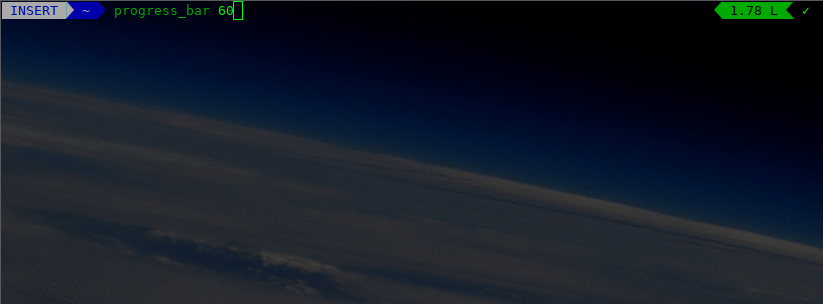

# progress_bar.sh
Progress bar for the shell

Display a progress bar for `$1` seconds.



It uses [partial Unicode blocks](https://en.wikipedia.org/wiki/Block_Elements#Character_table) to achieve subcharacter precision.

Example:

```
source progress_bar.sh
progress_bar 60
│█████████████████████████████████████████████████████████▌                                  │ 62%
```

You can time a long task and use it to have an idea of how much longer to wait

```
time ./compile.sh    # gives 300 seconds
./compile.sh &>/dev/null & progress_bar 300
│███████████████████████████████                                                             │ 31%
```

It requires a terminal session with unicode locales, for instance

```
export LC_ALL=en_US.UTF-8
export LANG=en_US.UTF-8
export LANGUAGE=en_US.UTF-8
```


Details at [Own Your Bits](https://ownyourbits.com/2017/07/16/a-progress-bar-for-the-shell/)
